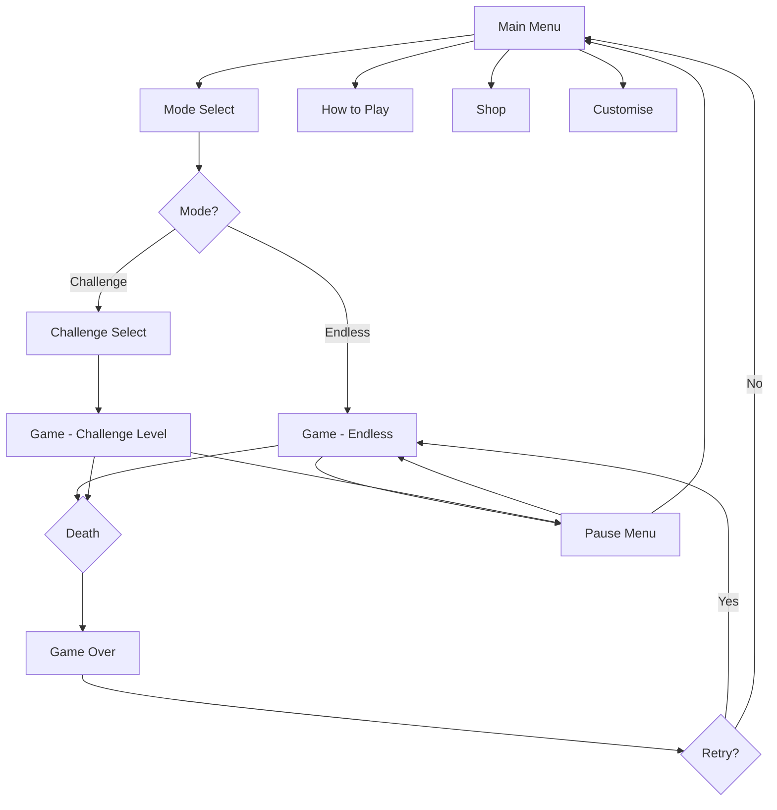

# Gravity Sprint - Implementation Plan

## Game Overview

**Gravity Sprint** is an endless runner where players flip gravity instead of jumping. Navigate obstacles by switching between floor and ceiling in this fast-paced, reflex-based game.

### Unique Mechanic
- **One-button control**: Press Space/Click to flip gravity
- **Dual surfaces**: Obstacles on both floor and ceiling
- **Disorienting gameplay**: Constant perspective switching
- **Progressive difficulty**: Speed and obstacle density increase over time

### Game Modes
1. **Endless Mode** - Survive as long as possible, progressive difficulty
2. **Challenge Mode** - 10 designed levels with specific patterns

---

## Technical Architecture

### Project Structure
```
gravity-sprint/
├── project.godot
├── icon.svg
├── scenes/
│   ├── main_menu.tscn
│   ├── mode_select.tscn
│   ├── game.tscn
│   ├── player.tscn
│   ├── obstacle.tscn
│   ├── game_over.tscn
│   ├── challenge_select.tscn
│   ├── pause_menu.tscn
│   ├── how_to_play.tscn
│   ├── shop.tscn
│   └── customise.tscn
├── scripts/
│   ├── game.gd
│   ├── player.gd
│   ├── obstacle.gd
│   ├── obstacle_spawner.gd
│   ├── difficulty_manager.gd
│   ├── score_manager.gd
│   ├── save_manager.gd
│   ├── unlock_manager.gd
│   ├── main_menu.gd
│   ├── mode_select.gd
│   ├── game_over.gd
│   ├── challenge_select.gd
│   ├── pause_menu.gd
│   ├── how_to_play.gd
│   ├── shop.gd
│   └── customise.gd
└── assets/
    └── placeholder/
```

---

## Core Systems Implementation

### 1. Player Controller with Gravity Flip

**Player.gd**

**Features:**
- Auto-moves forward at constant speed
- Gravity flip on input (Space/Click)
- Smooth transition between floor and ceiling
- Collision detection
- Death animation

**Gravity States:**
- `FLOOR`: Player on bottom, gravity pulls down
- `CEILING`: Player on top, gravity pulls up
- Transition time: 0.2 seconds for smooth flip

**Physics:**
- Horizontal speed: Controlled by DifficultyManager
- Vertical movement: Gravity-based (980 px/s²)
- Position clamping: Stay within screen bounds

### 2. Obstacle System

**Obstacle.gd**

**Obstacle Types:**
1. **Floor Block**: Static obstacle on floor
2. **Ceiling Block**: Static obstacle on ceiling
3. **Spike**: Hazard on floor or ceiling
4. **Gap**: Requires timing to navigate
5. **Moving Platform**: Obstacle that moves vertically

**Properties:**
- Position (floor/ceiling)
- Size
- Movement pattern (if applicable)
- Collision shape

### 3. Obstacle Spawner

**ObstacleSpawner.gd**

**Spawning Logic:**
- Spawn obstacles off-screen (right side)
- Minimum distance between obstacles
- Pattern-based spawning
- Difficulty-based density

**Patterns:**
- **Simple**: Single obstacles
- **Alternating**: Floor then ceiling
- **Combo**: Multiple flips required
- **Gauntlet**: Rapid succession

**Endless Mode Progression:**
- Start: 1 obstacle every 3 seconds
- Every 10 seconds: Increase density by 10%
- Maximum: 1 obstacle every 1 second

### 4. Difficulty Manager

**DifficultyManager.gd**

**Speed Progression (Endless Mode):**
- Starting speed: 400 px/s
- Increase: +20 px/s every 10 seconds
- Maximum speed: 800 px/s (2x starting)

**Challenge Mode:**
- Level 1-3: 400 px/s
- Level 4-6: 500 px/s
- Level 7-9: 650 px/s
- Level 10: 800 px/s

**Obstacle Density:**
- Easy: 1 obstacle per 3 seconds
- Medium: 1 obstacle per 2 seconds
- Hard: 1 obstacle per 1.5 seconds
- Extreme: 1 obstacle per 1 second

---

## Manager Systems

### ScoreManager.gd

**Scoring:**
- **Distance**: 1 point per unit traveled
- **Time Bonus**: 10 points per second survived
- **Speed Multiplier**: Score × (current_speed / base_speed)

**High Score Tracking:**
- Endless mode: Single high score
- Challenge mode: Best time per level

### SaveManager.gd

**Saves:**
- High score (endless)
- Best times (10 challenge levels)
- Unlocked challenge levels
- Settings (volume, controls)
- Unlocked themes/customizations
- Total distance traveled
- Total runs

**Format:** JSON at `user://gravity_sprint_save.json`

### UnlockManager.gd

**Progression:**
- Earn points based on distance traveled
- Unlock challenge levels (sequential)
- Unlock cosmetic themes

**Unlockables:**
- **Player Skins** (5): Classic (free), Neon (100pts), Pixel (200pts), Plasma (400pts), Gold (800pts)
- **Trails** (4): None (free), Basic (150pts), Particle (300pts), Rainbow (600pts)
- **Backgrounds** (5): Classic (free), Grid (100pts), Starfield (200pts), Abstract (400pts), Void (800pts)
- **Challenge Levels** (10): Unlock by completing previous level

---

## Scene Breakdown

### 1. Main Menu
- Title: "GRAVITY SPRINT"
- Subtitle: "Flip to Survive"
- Buttons: Play, How to Play, Customise, Shop, Quit

### 2. Mode Select
- **Endless Mode** button
- **Challenge Mode** button
- Back button

### 3. Game Scene
**Layout:**
- Player (left side, vertical center)
- Scrolling obstacles (right to left)
- Floor and ceiling boundaries
- Score display (top right)
- Distance display (top left)

**HUD:**
- Current score
- Distance traveled
- Speed indicator
- Pause button

### 4. Game Over
- "GAME OVER" title
- Final score
- Distance traveled
- High score comparison
- Retry button
- Main Menu button

### 5. Challenge Select
- Grid of 10 level buttons
- Show locked/unlocked status
- Show best time for completed levels
- Back button

### 6. Pause Menu
- Semi-transparent overlay
- Resume, Restart, Main Menu buttons

### 7. How to Play
- Controls explanation
- Gravity flip mechanic tutorial
- Tips for survival
- Obstacle type reference

### 8. Shop
- Player skins
- Trails
- Backgrounds
- Points balance display

### 9. Customise
- Select player skin
- Select trail
- Select background
- Preview area

---

## Game Flow



---

## Proposed Changes

### Core Game Files

#### [NEW] [project.godot](file:///d:/Project/NeverTooOldGaming/Startup/NeverTooOldGames/gravity-sprint/project.godot)
- Godot 4.5.1 configuration
- Display: 1920x1080, pixel-perfect scaling
- Input: Space/Click for gravity flip, ESC for pause

---

### Scenes (11 files)

#### [NEW] [main_menu.tscn](file:///d:/Project/NeverTooOldGaming/Startup/NeverTooOldGames/gravity-sprint/scenes/main_menu.tscn)
#### [NEW] [mode_select.tscn](file:///d:/Project/NeverTooOldGaming/Startup/NeverTooOldGames/gravity-sprint/scenes/mode_select.tscn)
#### [NEW] [game.tscn](file:///d:/Project/NeverTooOldGaming/Startup/NeverTooOldGames/gravity-sprint/scenes/game.tscn)
#### [NEW] [player.tscn](file:///d:/Project/NeverTooOldGaming/Startup/NeverTooOldGames/gravity-sprint/scenes/player.tscn)
#### [NEW] [obstacle.tscn](file:///d:/Project/NeverTooOldGaming/Startup/NeverTooOldGames/gravity-sprint/scenes/obstacle.tscn)
#### [NEW] [game_over.tscn](file:///d:/Project/NeverTooOldGaming/Startup/NeverTooOldGames/gravity-sprint/scenes/game_over.tscn)
#### [NEW] [challenge_select.tscn](file:///d:/Project/NeverTooOldGaming/Startup/NeverTooOldGames/gravity-sprint/scenes/challenge_select.tscn)
#### [NEW] [pause_menu.tscn](file:///d:/Project/NeverTooOldGaming/Startup/NeverTooOldGames/gravity-sprint/scenes/pause_menu.tscn)
#### [NEW] [how_to_play.tscn](file:///d:/Project/NeverTooOldGaming/Startup/NeverTooOldGames/gravity-sprint/scenes/how_to_play.tscn)
#### [NEW] [shop.tscn](file:///d:/Project/NeverTooOldGaming/Startup/NeverTooOldGames/gravity-sprint/scenes/shop.tscn)
#### [NEW] [customise.tscn](file:///d:/Project/NeverTooOldGaming/Startup/NeverTooOldGames/gravity-sprint/scenes/customise.tscn)

---

### Scripts (15 files)

#### Game Logic
#### [NEW] [game.gd](file:///d:/Project/NeverTooOldGaming/Startup/NeverTooOldGames/gravity-sprint/scripts/game.gd)
#### [NEW] [player.gd](file:///d:/Project/NeverTooOldGaming/Startup/NeverTooOldGames/gravity-sprint/scripts/player.gd)
#### [NEW] [obstacle.gd](file:///d:/Project/NeverTooOldGaming/Startup/NeverTooOldGames/gravity-sprint/scripts/obstacle.gd)
#### [NEW] [obstacle_spawner.gd](file:///d:/Project/NeverTooOldGaming/Startup/NeverTooOldGames/gravity-sprint/scripts/obstacle_spawner.gd)

#### Managers
#### [NEW] [difficulty_manager.gd](file:///d:/Project/NeverTooOldGaming/Startup/NeverTooOldGames/gravity-sprint/scripts/difficulty_manager.gd)
#### [NEW] [score_manager.gd](file:///d:/Project/NeverTooOldGaming/Startup/NeverTooOldGames/gravity-sprint/scripts/score_manager.gd)
#### [NEW] [save_manager.gd](file:///d:/Project/NeverTooOldGaming/Startup/NeverTooOldGames/gravity-sprint/scripts/save_manager.gd)
#### [NEW] [unlock_manager.gd](file:///d:/Project/NeverTooOldGaming/Startup/NeverTooOldGames/gravity-sprint/scripts/unlock_manager.gd)

#### UI
#### [NEW] [main_menu.gd](file:///d:/Project/NeverTooOldGaming/Startup/NeverTooOldGames/gravity-sprint/scripts/main_menu.gd)
#### [NEW] [mode_select.gd](file:///d:/Project/NeverTooOldGaming/Startup/NeverTooOldGames/gravity-sprint/scripts/mode_select.gd)
#### [NEW] [game_over.gd](file:///d:/Project/NeverTooOldGaming/Startup/NeverTooOldGames/gravity-sprint/scripts/game_over.gd)
#### [NEW] [challenge_select.gd](file:///d:/Project/NeverTooOldGaming/Startup/NeverTooOldGames/gravity-sprint/scripts/challenge_select.gd)
#### [NEW] [pause_menu.gd](file:///d:/Project/NeverTooOldGaming/Startup/NeverTooOldGames/gravity-sprint/scripts/pause_menu.gd)
#### [NEW] [how_to_play.gd](file:///d:/Project/NeverTooOldGaming/Startup/NeverTooOldGames/gravity-sprint/scripts/how_to_play.gd)
#### [NEW] [shop.gd](file:///d:/Project/NeverTooOldGaming/Startup/NeverTooOldGames/gravity-sprint/scripts/shop.gd)
#### [NEW] [customise.gd](file:///d:/Project/NeverTooOldGaming/Startup/NeverTooOldGames/gravity-sprint/scripts/customise.gd)

---

### Assets
#### [NEW] [icon.svg](file:///d:/Project/NeverTooOldGaming/Startup/NeverTooOldGames/gravity-sprint/icon.svg)

---

## Verification Plan

### Automated Tests
- Run in Godot editor
- Test gravity flip responsiveness
- Test obstacle spawning patterns
- Test difficulty progression
- Verify save/load

### Manual Verification
- Play endless mode to test feel
- Complete challenge levels
- Verify progression system
- Test all UI screens

---

## Implementation Order

1. ✅ Project setup
2. ✅ Player with gravity flip
3. ✅ Obstacle system
4. ✅ Obstacle spawner
5. ✅ Game scene with scrolling
6. ✅ Collision and death
7. ✅ Score manager
8. ✅ Difficulty progression
9. ✅ UI screens
10. ✅ Save/load system
11. ✅ Progression and unlockables
12. ✅ Challenge mode
13. ✅ Polish and testing

---

## Ready to Implement

All design documents reviewed. Architecture planned based on Match Master standards. Ready to begin implementation.

**Estimated Time:** 1.5-2 hours for complete code implementation  
**Files to Create:** ~27 files (1 project + 11 scenes + 15 scripts)
